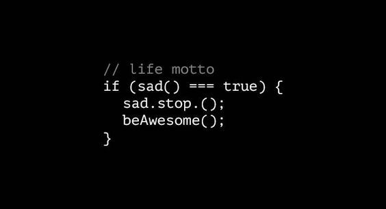

<!--  -->

# Hi there, 👋 I'm **Michael** a.k.a **Mbaya**
### Welcome to my tech space. 
### I'm an enthusiastic developer. I love programming and am currently looking for opportunities. Feel Free to contact me
---

- 💻 I’m currently learning **PHP**
- 🤜🏻🤛🏻 I’m looking to collaborate on **JavaScript/TypeScript based projects**
- 🤔 I’m looking for help with **Design skills** 
- 💬 Ask me about **anything i will try to help you if i can**
- 📫 How to reach me: **Email [Michael-Mbaya](mailto:michaelmbaya1@gmail.com)**
- 😄 Pronouns: **He/Him**
- ⚡ Fun fact: **✨ I'm not that addicted to coffee☕, music and Long distracting walks and talks rejuvinate my mind.✨**

---
## My stats over here
_NOTE: Top languages does not indicate my skill level or something like that, it's a github metric of which languages I have the most code on github_

    
    

---